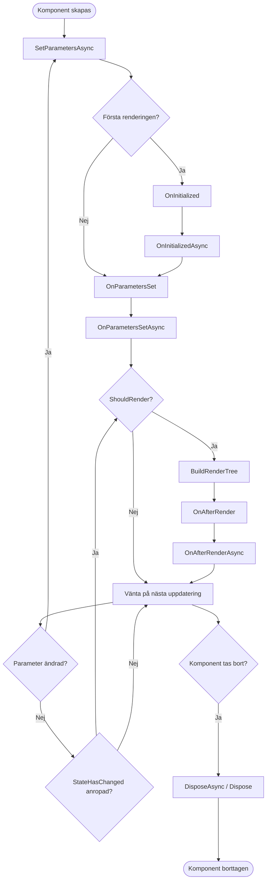
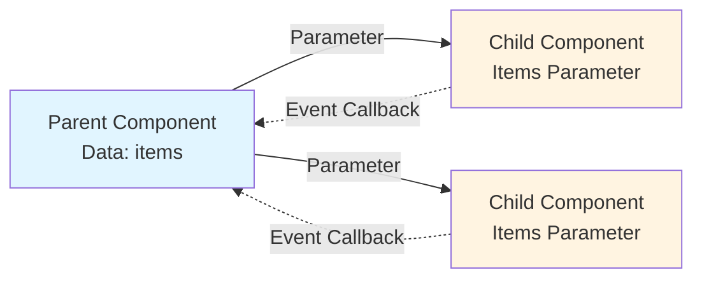
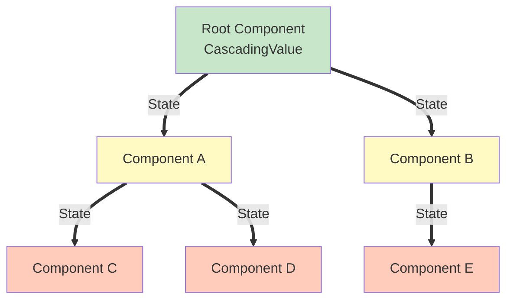
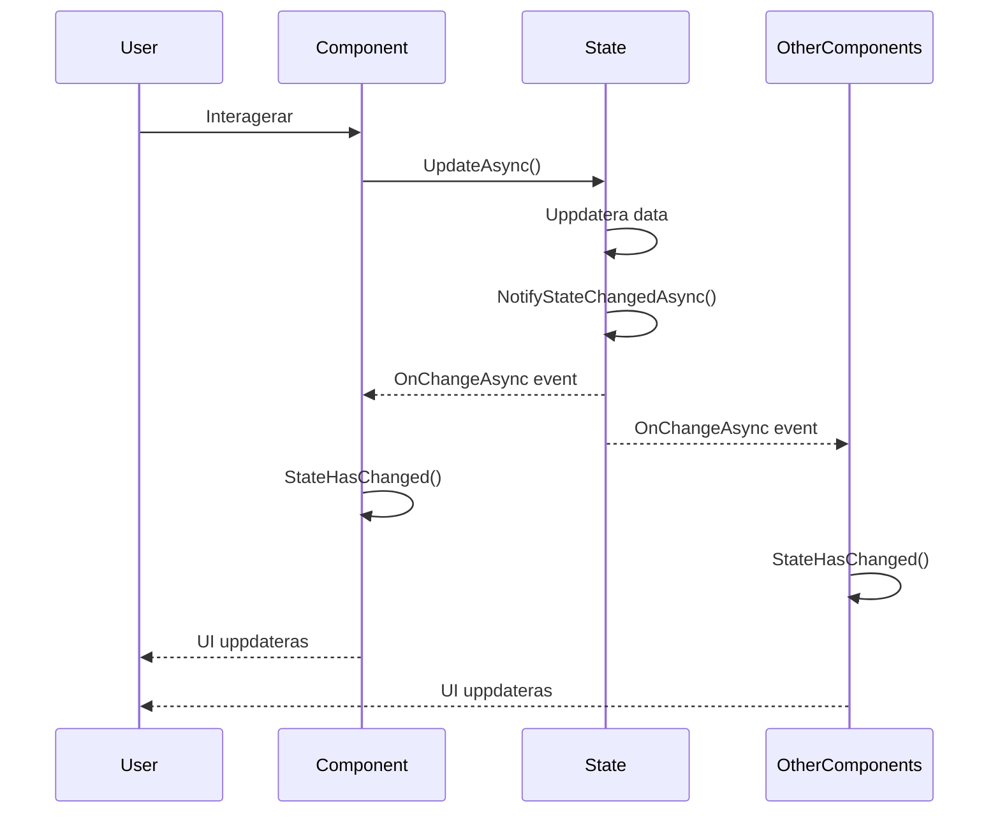
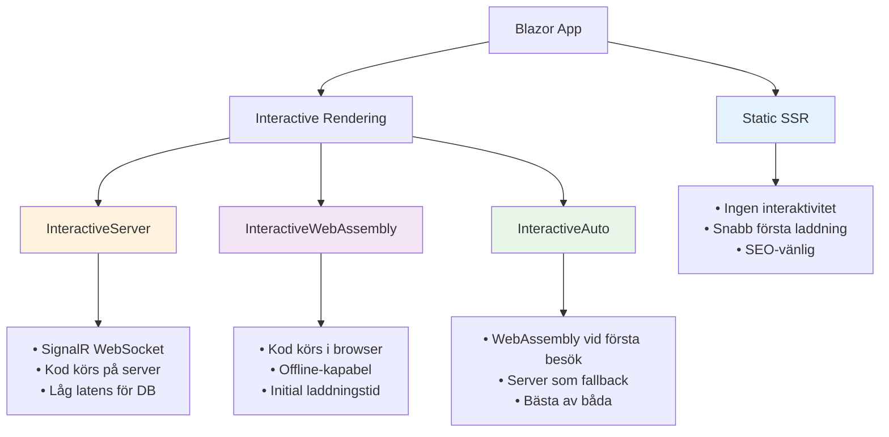
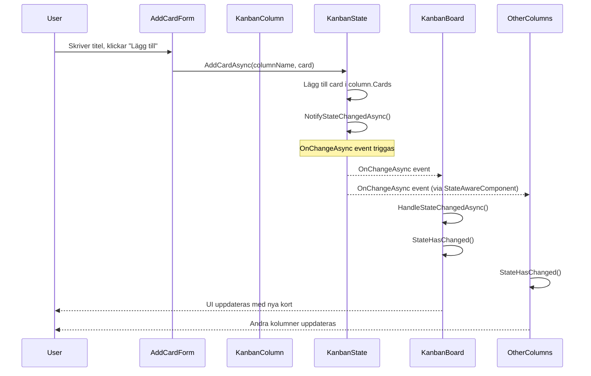
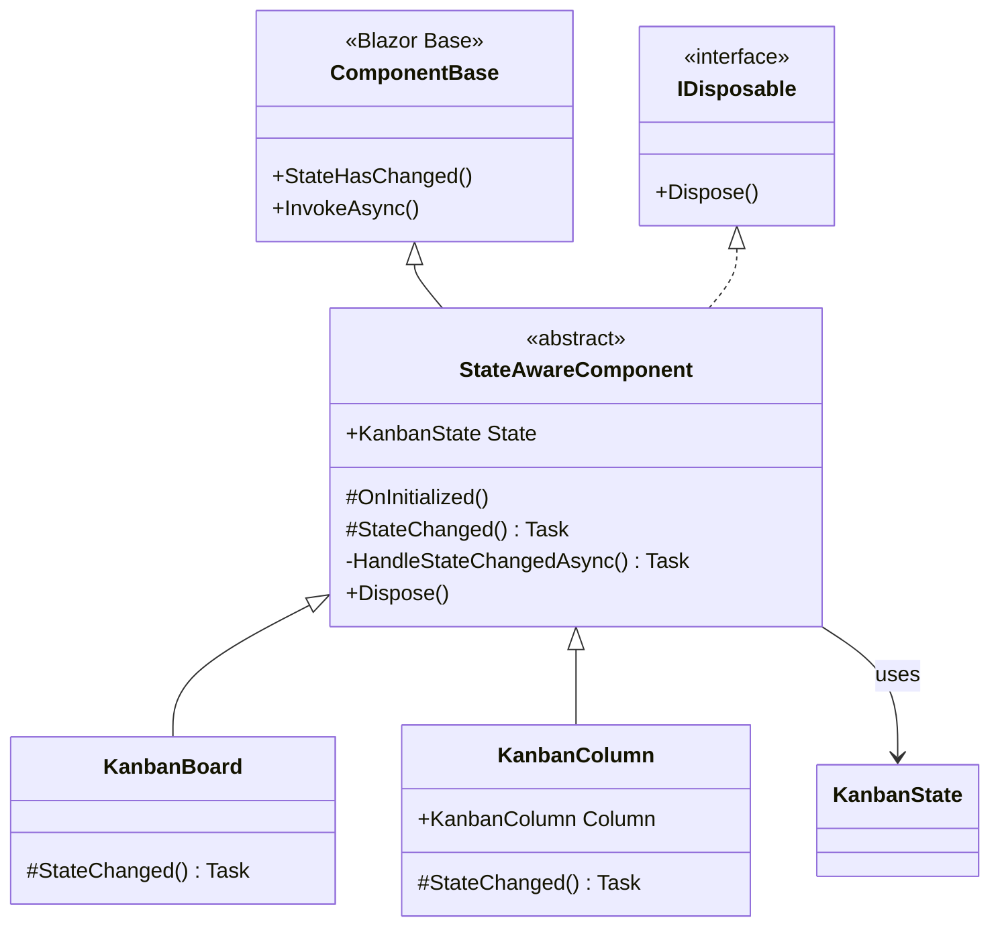
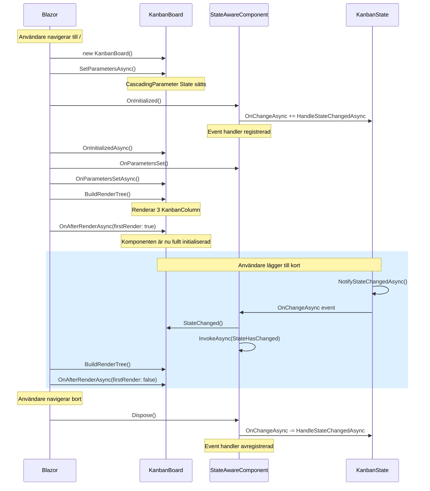

# Blazor Komponent Livscykel och Dataflöde

## Innehållsförteckning
- [Komponent Livscykel](#komponent-livscykel)
- [Dataflöde i Blazor](#dataflöde-i-blazor)
- [Render Modes och deras påverkan](#render-modes-och-deras-påverkan)
- [Minikanban-applikationens arkitektur](#minikanban-applikationens-arkitektur)
- [Best Practices](#best-practices)

---

## Komponent Livscykel

### Blazor Komponent Livscykel Faser



### Livscykel-metoder i detalj

#### 1. **SetParametersAsync**
- Första metoden som anropas
- Tar emot parametrar från parent-komponenten
- Kan avbrytas för custom parameter-hantering
- Anropas varje gång parametrar ändras

```csharp
public override async Task SetParametersAsync(ParameterView parameters)
{
    // Custom logik innan parametrar sätts
    await base.SetParametersAsync(parameters);
    // Custom logik efter parametrar sätts
}
```

#### 2. **OnInitialized / OnInitializedAsync**
- Anropas EN gång när komponenten initialiseras
- Perfekt för att sätta upp event handlers
- Cascading parameters är tillgängliga här
- Synkron (OnInitialized) körs före async (OnInitializedAsync)

```csharp
protected override void OnInitialized()
{
    // ⚠️ State MÅSTE vara tillgänglig här (cascading parameter)
    State.OnChangeAsync += HandleStateChangedAsync;
}

protected override async Task OnInitializedAsync()
{
    // Asynkron initialisering (API-anrop, etc.)
    await LoadDataAsync();
}
```

#### 3. **OnParametersSet / OnParametersSetAsync**
- Anropas efter OnInitialized OCH när parametrar ändras
- Använd för att reagera på parameter-ändringar
- Anropas varje rendering efter den första

```csharp
protected override void OnParametersSet()
{
    // Reagera på parameter-ändringar
    if (Column != null)
    {
        // Uppdatera intern state baserat på ny parameter
    }
}
```

#### 4. **OnAfterRender / OnAfterRenderAsync**
- Anropas efter varje rendering
- Perfekt för JavaScript interop
- `firstRender` parameter indikerar första renderingen
- **Kör INTE StateHasChanged här** (risk för oändlig loop)

```csharp
protected override async Task OnAfterRenderAsync(bool firstRender)
{
    if (firstRender)
    {
        // Initialisera JS-bibliotek, etc.
        await JSRuntime.InvokeVoidAsync("initializeComponent");
    }
}
```

#### 5. **Dispose / DisposeAsync**
- Anropas när komponenten tas bort
- KRITISKT att avregistrera event handlers
- Förhindrar minnesläckor

```csharp
public void Dispose()
{
    if (State is not null)
    {
        State.OnChangeAsync -= HandleStateChangedAsync;
    }
}
```

---

## Dataflöde i Blazor

### Unidirektionellt Dataflöde (Parent → Child)



**Princip**: Data flödar nedåt, events flödar uppåt.

### 1. Parameters (Parent → Child)

```csharp
// Parent Component
<ChildComponent Title="Min Titel" Count="@itemCount" />

// Child Component
[Parameter] public string Title { get; set; } = string.Empty;
[Parameter] public int Count { get; set; }
```

### 2. EventCallback (Child → Parent)

```csharp
// Child Component
[Parameter] public EventCallback<string> OnItemClicked { get; set; }

private async Task HandleClick(string item)
{
    await OnItemClicked.InvokeAsync(item);
}

// Parent Component
<ChildComponent OnItemClicked="HandleItemClicked" />

@code {
    private void HandleItemClicked(string item)
    {
        // Hantera event från child
    }
}
```

### 3. Cascading Parameters (Ancestor → Descendants)



**Viktig regel**: Cascading parameters kan INTE passera över render mode-gränser!

```csharp
// Provider (Ancestor)
<CascadingValue Value="@sharedState">
    @ChildContent
</CascadingValue>

// Consumer (Descendant)
[CascadingParameter] public SharedState State { get; set; } = default!;
```

### 4. State Management Pattern (Observable)



**Implementation**:

```csharp
// State Service
public class KanbanState
{
    public event Func<Task>? OnChangeAsync;
    
    public async Task AddCardAsync(string columnName, KanbanCard card)
    {
        // Uppdatera data
        var column = Columns.First(c => c.Name == columnName);
        column.Cards.Add(card);
        
        // Notifiera subscribers
        await NotifyStateChangedAsync();
    }
    
    private Task NotifyStateChangedAsync() => 
        OnChangeAsync?.Invoke() ?? Task.CompletedTask;
}

// Component
protected override void OnInitialized()
{
    State.OnChangeAsync += HandleStateChangedAsync;
}

private async Task HandleStateChangedAsync()
{
    await InvokeAsync(StateHasChanged); // Re-render komponenten
}

public void Dispose()
{
    State.OnChangeAsync -= HandleStateChangedAsync;
}
```

---

## Render Modes och deras påverkan

### Blazor .NET 8+ Render Modes



### Render Mode Boundaries - KRITISKT!

```mermaid
flowchart TB
    subgraph Static["Static SSR Context"]
        AppRazor[App.razor<br/>❌ CascadingValue här]
    end
    
    subgraph Interactive["InteractiveServer Boundary"]
        Routes[Routes.razor<br/>@rendermode='InteractiveServer']
        
        subgraph Layout["MainLayout Context"]
            MainLayout[MainLayout.razor<br/>✅ CascadingValue här]
            Body[Page Body]
        end
    end
    
    AppRazor -.->|Gränsen!| Routes
    Routes --> MainLayout
    MainLayout --> Body
    
    style AppRazor fill:#ffcdd2
    style Routes fill:#fff9c4
    style MainLayout fill:#c8e6c9
```

**Varför detta är viktigt**:

1. **Cascading parameters** kan INTE passera över render mode-gränser
2. **Dependency Injection** fungerar annorlunda beroende på mode
3. **JavaScript Interop** kräver olika approaches
4. **State management** måste anpassas efter mode

### Fel vs Rätt Implementation

❌ **FEL** - CascadingValue utanför InteractiveServer:

```csharp
// App.razor
<CascadingValue Value="State">
    <Routes @rendermode="RenderMode.InteractiveServer" />
</CascadingValue>
// State kommer vara NULL i komponenter!
```

✅ **RÄTT** - CascadingValue innanför InteractiveServer:

```csharp
// App.razor
<Routes @rendermode="RenderMode.InteractiveServer" />

// MainLayout.razor (innanför Routes)
@inject KanbanState State

<CascadingValue Value="State">
    <div class="page">
        @Body
    </div>
</CascadingValue>
```

---

## Minikanban-applikationens arkitektur

### Komponent-hierarki

```mermaid
flowchart TD
    App[App.razor<br/>Static SSR] --> Routes[Routes.razor<br/>@rendermode InteractiveServer]
    Routes --> MainLayout[MainLayout.razor<br/>CascadingValue: KanbanState]
    MainLayout --> Home[Home.razor<br/>Page]
    Home --> KanbanBoard[KanbanBoard<br/>StateAwareComponent]
    KanbanBoard --> KanbanColumn1[KanbanColumn: Todo]
    KanbanBoard --> KanbanColumn2[KanbanColumn: Doing]
    KanbanBoard --> KanbanColumn3[KanbanColumn: Done]
    KanbanColumn1 --> Cards1[KanbanCard...]
    KanbanColumn1 --> Form1[AddCardForm]
    KanbanColumn2 --> Cards2[KanbanCard...]
    KanbanColumn2 --> Form2[AddCardForm]
    KanbanColumn3 --> Cards3[KanbanCard...]
    KanbanColumn3 --> Form3[AddCardForm]
    
    style App fill:#e3f2fd
    style Routes fill:#fff9c4
    style MainLayout fill:#c8e6c9
    style KanbanBoard fill:#ffe0b2
    style KanbanColumn1 fill:#f8bbd0
    style KanbanColumn2 fill:#f8bbd0
    style KanbanColumn3 fill:#f8bbd0
```

### Dataflöde i Minikanban



### StateAwareComponent Pattern



**Fördelar med detta pattern**:
1. ✅ DRY - Ingen duplicerad event handler-kod
2. ✅ Automatisk cleanup via Dispose
3. ✅ Konsekvent state management
4. ✅ Override hook för custom beteende

### Komplett livscykel för KanbanBoard



---

## Best Practices

### ✅ DO - Rekommenderade metoder

#### 1. Cascading Parameters inom rätt scope
```csharp
// ✅ Rätt - Innanför InteractiveServer boundary
// MainLayout.razor
@inject KanbanState State

<CascadingValue Value="State">
    @Body
</CascadingValue>
```

#### 2. Null-checks för CascadingParameters
```csharp
// ✅ Rätt - Defensiv programmering
protected override void OnInitialized()
{
    if (State is not null)
    {
        State.OnChangeAsync += HandleStateChangedAsync;
    }
}
```

#### 3. Alltid Dispose event handlers
```csharp
// ✅ Rätt - Förhindrar minnesläckor
public void Dispose()
{
    if (State is not null)
    {
        State.OnChangeAsync -= HandleStateChangedAsync;
    }
}
```

#### 4. InvokeAsync för thread-safety
```csharp
// ✅ Rätt - Säker uppdatering från annat context
private async Task HandleStateChangedAsync()
{
    await InvokeAsync(StateHasChanged);
}
```

#### 5. Asynkrona operations med CancellationToken
```csharp
// ✅ Rätt - Avbrytbar async operation
protected override async Task OnInitializedAsync()
{
    await LoadDataAsync(CancellationToken);
}
```

### ❌ DON'T - Undvik dessa mönster

#### 1. StateHasChanged i OnAfterRender
```csharp
// ❌ FEL - Risk för oändlig loop
protected override async Task OnAfterRenderAsync(bool firstRender)
{
    StateHasChanged(); // FARLIGT!
}
```

#### 2. Glömma att avregistrera events
```csharp
// ❌ FEL - Minnesläcka!
protected override void OnInitialized()
{
    State.OnChangeAsync += HandleStateChangedAsync;
}
// Ingen Dispose-metod = minnesläcka
```

#### 3. CascadingValue utanför render mode
```csharp
// ❌ FEL - Fungerar inte över boundary
// App.razor
<CascadingValue Value="State">
    <Routes @rendermode="InteractiveServer" />
</CascadingValue>
```

#### 4. Synkron kod i async-metoder
```csharp
// ❌ FEL - Blockerar tråd
protected override async Task OnInitializedAsync()
{
    var data = GetDataAsync().Result; // Blockerar!
}

// ✅ Rätt
protected override async Task OnInitializedAsync()
{
    var data = await GetDataAsync();
}
```

#### 5. Mutating state direkt utan notifikation
```csharp
// ❌ FEL - Andra komponenter får inte veta
column.Cards.Add(newCard); // UI uppdateras inte!

// ✅ Rätt - Via state service
await State.AddCardAsync(columnName, newCard); // Triggar events
```

### Performance Best Practices

#### 1. ShouldRender för att undvika onödiga renderingar
```csharp
protected override bool ShouldRender()
{
    // Rendera bara om relevant data ändrats
    return hasRelevantChanges;
}
```

#### 2. Virtualisering för stora listor
```razor
<Virtualize Items="@largeList" Context="item">
    <ItemTemplate>
        <div>@item.Name</div>
    </ItemTemplate>
</Virtualize>
```

#### 3. Streaming rendering för stora komponenter
```csharp
@attribute [StreamRendering(true)]
```

---

## Felsökning - Vanliga problem

### Problem 1: NullReferenceException på CascadingParameter

**Symptom**: `State` är null i `OnInitialized`

**Orsak**: CascadingValue är utanför render mode boundary

**Lösning**: Flytta CascadingValue till en komponent innanför InteractiveServer
```csharp
// Flytta från App.razor till MainLayout.razor
```

### Problem 2: UI uppdateras inte när state ändras

**Symptom**: Data ändras men UI visar gamla värden

**Orsaker**:
- Glömt att anropa `StateHasChanged()`
- Event handler inte registrerad
- State ändras direkt utan att gå via service

**Lösning**:
```csharp
// Alltid uppdatera via state service
await State.UpdateDataAsync(); // Detta triggar OnChangeAsync

// Komponenter lyssnar på event
State.OnChangeAsync += async () => await InvokeAsync(StateHasChanged);
```

### Problem 3: Minnesläckor

**Symptom**: Ökande minnesanvändning över tid

**Orsak**: Event handlers inte avregistrerade

**Lösning**:
```csharp
public void Dispose()
{
    State.OnChangeAsync -= HandleStateChangedAsync;
}
```

### Problem 4: Race conditions i async operations

**Symptom**: Inkonsekvent state, felaktiga värden

**Orsak**: Flera async operations ändrar samma state samtidigt

**Lösning**:
```csharp
private readonly SemaphoreSlim _semaphore = new(1, 1);

public async Task UpdateAsync()
{
    await _semaphore.WaitAsync();
    try
    {
        // Kritisk sektion
        await UpdateDataAsync();
    }
    finally
    {
        _semaphore.Release();
    }
}
```

---

## Sammanfattning

### Livscykel i korrekt ordning:
1. **SetParametersAsync** - Parametrar sätts
2. **OnInitialized** - Första initieringen (EN gång)
3. **OnInitializedAsync** - Async initiering (EN gång)
4. **OnParametersSet** - Efter parametrar sätts (varje gång)
5. **OnParametersSetAsync** - Async parameter-hantering
6. **BuildRenderTree** - Rendering
7. **OnAfterRender** - Efter rendering
8. **OnAfterRenderAsync** - Async efter rendering
9. **Dispose/DisposeAsync** - Cleanup

### Dataflöde-principer:
- ⬇️ **Data flödar nedåt** via Parameters och CascadingParameters
- ⬆️ **Events flödar uppåt** via EventCallback
- 🔄 **State delas** via Services och Observable pattern
- 🚧 **Render modes skapar boundaries** som data inte kan passera

### Nycklar till framgång:
1. ✅ Förstå render mode boundaries
2. ✅ Alltid dispose event handlers
3. ✅ Använd InvokeAsync för thread-safety
4. ✅ Null-check cascading parameters
5. ✅ Låt state services hantera uppdateringar
6. ✅ Följ unidirektionellt dataflöde

---

**Skapad för Minikanban-projektet** | .NET 8 Blazor InteractiveServer
