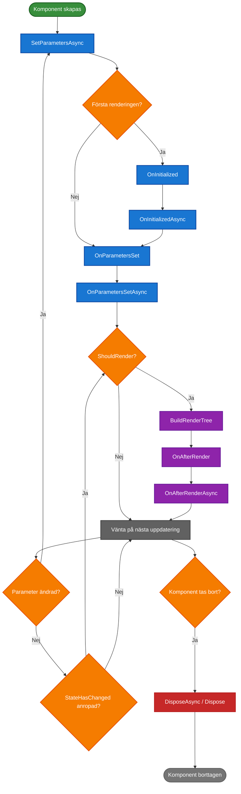

# Komponentlivscykel

[⟵ Till översikten](README.md)

## Blazor Komponentlivscykel – faser



## Livscykelmetoder i detalj

### 1. `SetParametersAsync`
- Första metoden som anropas
- Tar emot parametrar från parent-komponenten
- Kan avbrytas för anpassad parameterhantering
- Anropas varje gång parametrar ändras

```csharp
public override async Task SetParametersAsync(ParameterView parameters)
{
    // Logik innan parametrar sätts
    await base.SetParametersAsync(parameters);
    // Logik efter att parametrar satts
}
```

### 2. `OnInitialized` / `OnInitializedAsync`
- Körs en gång när komponenten initialiseras
- Bra för att registrera event handlers och initiera data
- Cascading parameters finns tillgängliga här
- Synkron `OnInitialized` kör före `OnInitializedAsync`

```csharp
protected override void OnInitialized()
{
    State.OnChangeAsync += HandleStateChangedAsync;
}

protected override async Task OnInitializedAsync()
{
    await LoadDataAsync();
}
```

### 3. `OnParametersSet` / `OnParametersSetAsync`
- Körs efter `OnInitialized` och när parametrar ändras
- Reagera på parameterändringar och uppdatera internt state

```csharp
protected override void OnParametersSet()
{
    if (Column != null)
    {
        // Uppdatera internt state
    }
}
```

### 4. `OnAfterRender` / `OnAfterRenderAsync`
- Körs efter varje rendering
- Bra för JavaScript interop
- Använd `firstRender` för engångsinitiering
- Undvik att kalla `StateHasChanged` direkt här

```csharp
protected override async Task OnAfterRenderAsync(bool firstRender)
{
    if (firstRender)
    {
        await JSRuntime.InvokeVoidAsync("initializeComponent");
    }
}
```

### 5. `Dispose` / `DisposeAsync`
- Körs när komponenten tas bort
- Avregistrera events för att undvika minnesläckor

```csharp
public void Dispose()
{
    if (State is not null)
    {
        State.OnChangeAsync -= HandleStateChangedAsync;
    }
}
```
