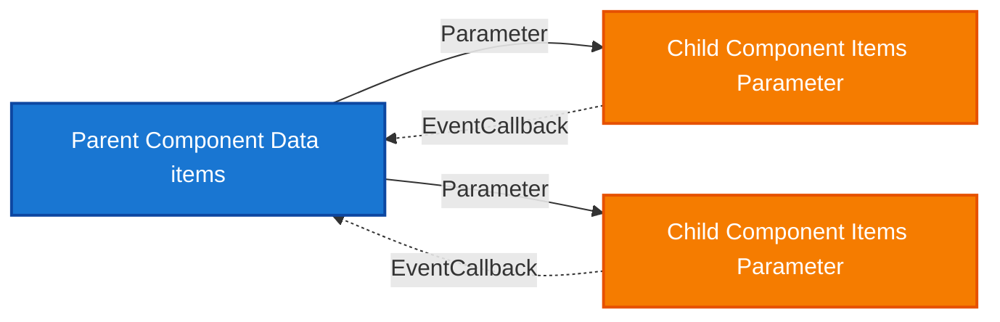
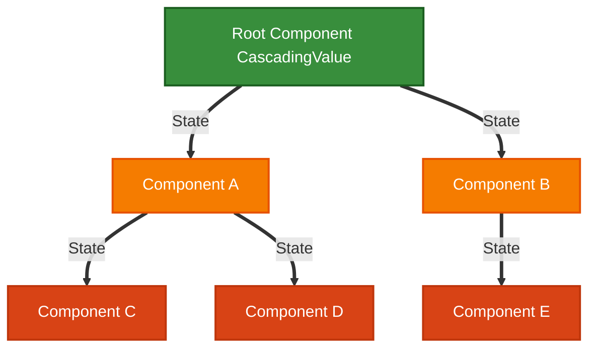
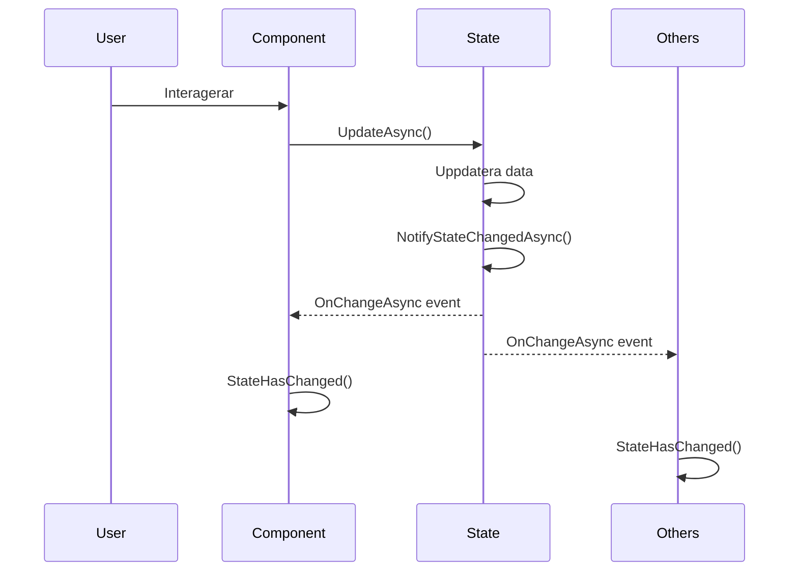

# Dataflöde i Blazor

[⟵ Till översikten](README.md)

## Unidirektionellt dataflöde (Parent → Child)



**Princip:** Data flödar nedåt via `Parameter`/`CascadingParameter`; händelser flödar uppåt via `EventCallback`.

### 1. Parameters (Parent → Child)

```razor
<!-- Parent Component -->
<ChildComponent Title="Min Titel" Count="@itemCount" />

<!-- Child Component -->
@code {
    [Parameter] public string Title { get; set; } = string.Empty;
    [Parameter] public int Count { get; set; }
}
```

### 2. EventCallback (Child → Parent)

```csharp
// Child Component
[Parameter] public EventCallback<string> OnItemClicked { get; set; }

private async Task HandleClick(string item)
{
    await OnItemClicked.InvokeAsync(item);
}
```

```razor
<!-- Parent Component -->
<ChildComponent OnItemClicked="HandleItemClicked" />

@code {
    private void HandleItemClicked(string item)
    {
        // Hantera event från child
    }
}
```

### 3. Cascading Parameters (Ancestor → Descendants)



**Regel:** Cascading parameters kan inte passera över render mode-gränser.

```razor
<!-- Provider (Ancestor) -->
<CascadingValue Value="@sharedState">
    @ChildContent
</CascadingValue>

<!-- Consumer (Descendant) -->
@code {
    [CascadingParameter] public SharedState State { get; set; } = default!;
}
```

### 4. Observerbart state (service + notifikation)



```csharp
public class AppState
{
    public event Func<Task>? OnChangeAsync;

    public async Task UpdateAsync()
    {
        // Uppdatera data
        await NotifyStateChangedAsync();
    }

    private Task NotifyStateChangedAsync() =>
        OnChangeAsync?.Invoke() ?? Task.CompletedTask;
}

protected override void OnInitialized()
{
    State.OnChangeAsync += HandleStateChangedAsync;
}

private async Task HandleStateChangedAsync()
{
    await InvokeAsync(StateHasChanged);
}

public void Dispose()
{
    State.OnChangeAsync -= HandleStateChangedAsync;
}
```
