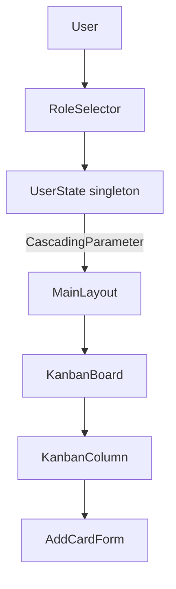
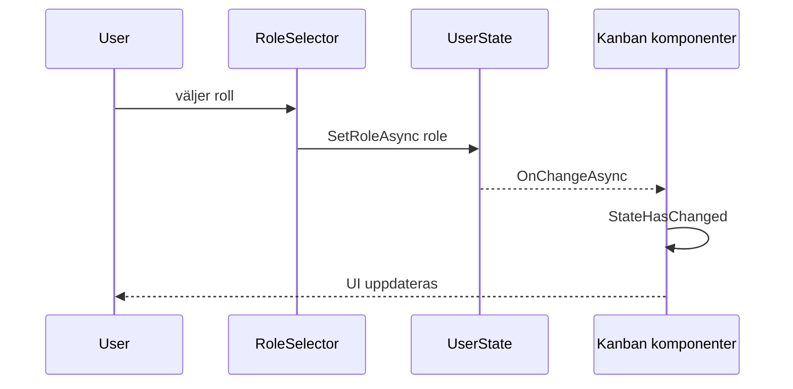

# Identity-light och UI-behörighetsstyrning — kort teori

## Varför?
Snabbt träna rollstyrd UI utan backend/Identity-konfiguration.

## Översikt

## Händelseflöde

## Begrepp
- **UI-behörighetsstyrning**: Hide/Disable baserat på roll.
- **UserState**: simulerad roll, notifierar vid ändring.
