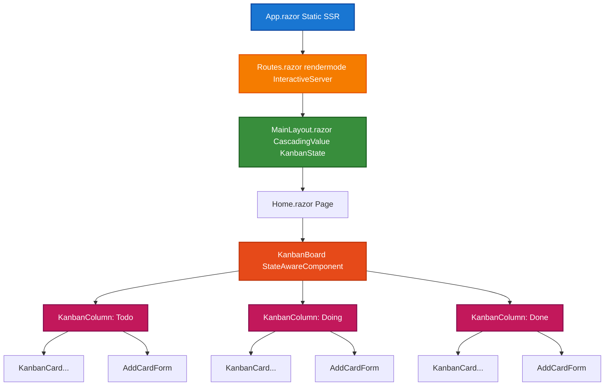

# Arkitekturöversikt

[⟵ Till översikten](README.md)

```mermaid
flowchart TD
    App["App.razor Static SSR"] --> Routes["Routes.razor rendermode InteractiveServer"]
    Routes --> MainLayout["MainLayout.razor CascadingValue KanbanState"]
    MainLayout --> Home["Home.razor Page"]
    Home --> KanbanBoard["KanbanBoard StateAwareComponent"]
    KanbanBoard --> KanbanColumn1["KanbanColumn: Todo"]
    KanbanBoard --> KanbanColumn2["KanbanColumn: Doing"]
    KanbanBoard --> KanbanColumn3["KanbanColumn: Done"]
    KanbanColumn1 --> Cards1["KanbanCard..."]
    KanbanColumn1 --> Form1["AddCardForm"]
    KanbanColumn2 --> Cards2["KanbanCard..."]
    KanbanColumn2 --> Form2["AddCardForm"]
    KanbanColumn3 --> Cards3["KanbanCard..."]
    KanbanColumn3 --> Form3["AddCardForm"]

    style App fill:#1976D2,color:#fff,stroke:#0D47A1,stroke-width:2px
    style Routes fill:#F57C00,color:#fff,stroke:#E65100,stroke-width:2px
    style MainLayout fill:#388E3C,color:#fff,stroke:#1B5E20,stroke-width:2px
    style KanbanBoard fill:#E64A19,color:#fff,stroke:#BF360C,stroke-width:2px
    style KanbanColumn1 fill:#C2185B,color:#fff,stroke:#880E4F,stroke-width:2px
    style KanbanColumn2 fill:#C2185B,color:#fff,stroke:#880E4F,stroke-width:2px
    style KanbanColumn3 fill:#C2185B,color:#fff,stroke:#880E4F,stroke-width:2px
```
