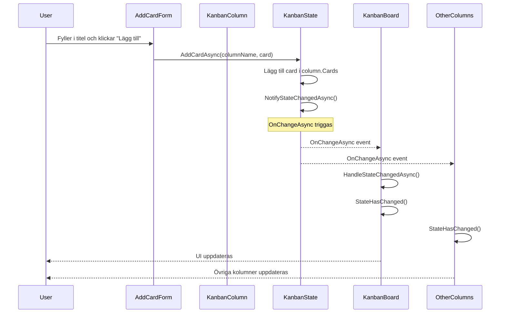

# Dataflöde i Minikanban

[⟵ Till översikten](README.md)

```mermaid
sequenceDiagram
    participant User
    participant AddCardForm
    participant KanbanColumn
    participant KanbanState
    participant KanbanBoard
    participant OtherColumns

    User->>AddCardForm: Fyller i titel och klickar "Lägg till"
    AddCardForm->>KanbanState: AddCardAsync(columnName, card)
    KanbanState->>KanbanState: Lägg till card i column.Cards
    KanbanState->>KanbanState: NotifyStateChangedAsync()

    Note over KanbanState: OnChangeAsync triggas

    KanbanState-->>KanbanBoard: OnChangeAsync event
    KanbanState-->>OtherColumns: OnChangeAsync event

    KanbanBoard->>KanbanBoard: HandleStateChangedAsync()
    KanbanBoard->>KanbanBoard: StateHasChanged()
    OtherColumns->>OtherColumns: StateHasChanged()

    KanbanBoard-->>User: UI uppdateras
    OtherColumns-->>User: Övriga kolumner uppdateras
```
