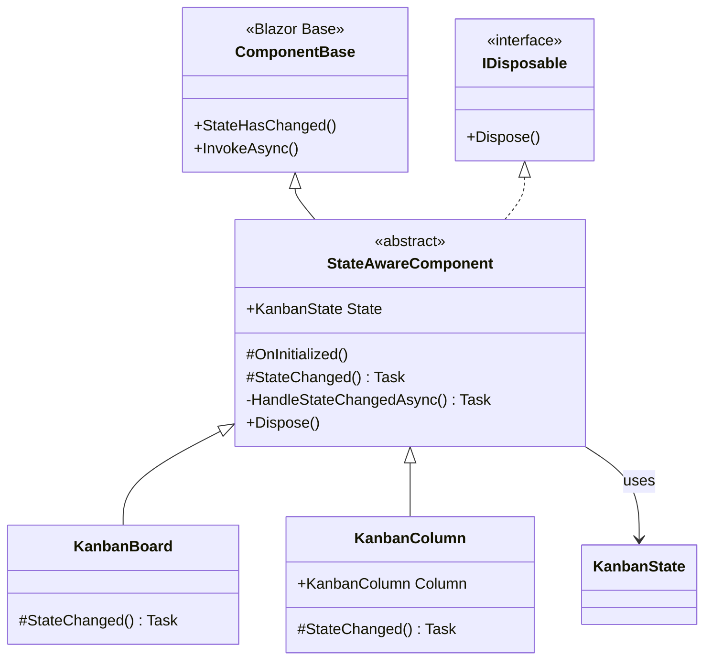

# StateAwareComponent-pattern

[⟵ Till översikten](README.md)

**Syfte:**
- Minska duplicering av eventregistrering och -avregistrering
- Säkerställa konsekvent state-lyssning och återrendering
- Tillhandahålla en överstyrbar hook (`StateChanged`) för anpassning
